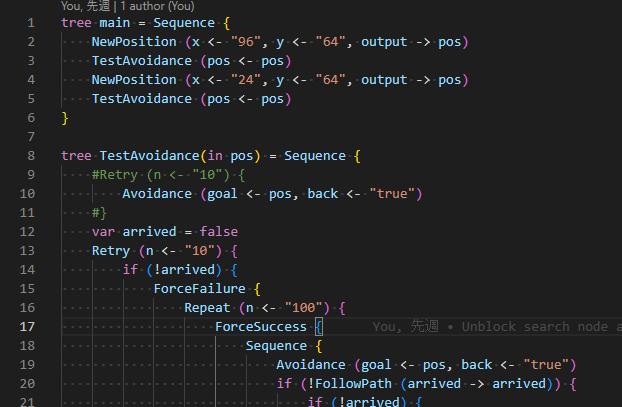

# rusty-behavior-tree-lite README

An extension for [rusty-behavior-tree-lite](https://github.com/msakuta/rusty-behavior-tree) language syntax highlighting.

## Features

Syntax highlighting for:

* Keywords
* Literals
* Line comments

It is very simple, but helps visibility a lot.

